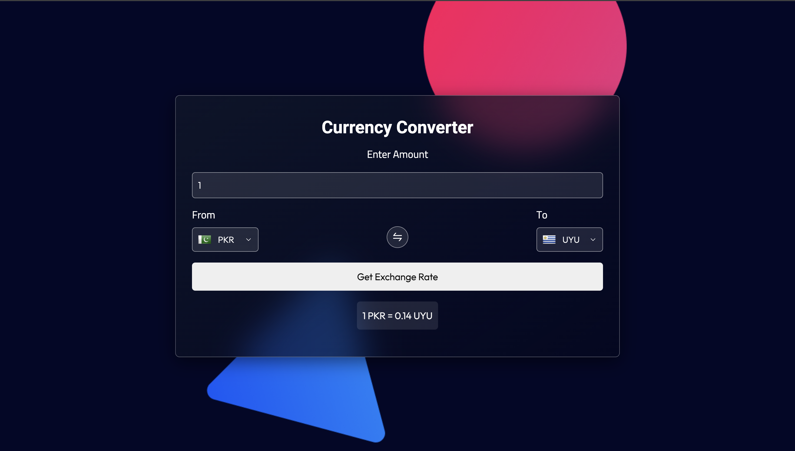
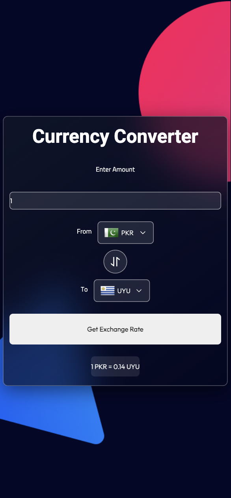

## 📫 Contact

Made with ❤️ by [Awais Arif](mailto:awaisariff004@gmail.com)
# 💱 Currency Converter Web App

A simple and responsive currency converter built with **React.js**. It fetches real-time exchange rates and displays currency conversion with country flags.

---

## 🌍 Live Exchange Rate Conversion

- 🌐 Convert any amount from one currency to another
- 🇺🇸 Country flags auto-update with selected currencies
- 🔄 Swap currencies instantly
- 📱 Fully responsive design (mobile-friendly)
- 🎨 Stylish glassmorphism UI with custom fonts

---

## 🚀 Tech Stack

- **React.js**
- **JavaScript (ES6)**
- **CSS3 / Media Queries**
- **ExchangeRate API**: [https://api.exchangerate-api.com](https://api.exchangerate-api.com)
- **Country Flags**: [https://countryflagsapi.com](https://countryflagsapi.com) *(updated from flagsapi.com)*

---

## 🖥️ Screenshots

| Desktop | Mobile |
|--------|--------|
|  |  |

---
## ✨ Features

- Real-time currency conversion using ExchangeRate API
- Intuitive country flag display
- One-click currency swapping
- Responsive design (mobile/tablet/desktop)
- Modern UI with glassmorphism effect

---


```bash
# Clone the repository
git clone https://github.com/your-username/currency-converter-app.git

# Install dependencies
npm install

# Start the development server
npm start
